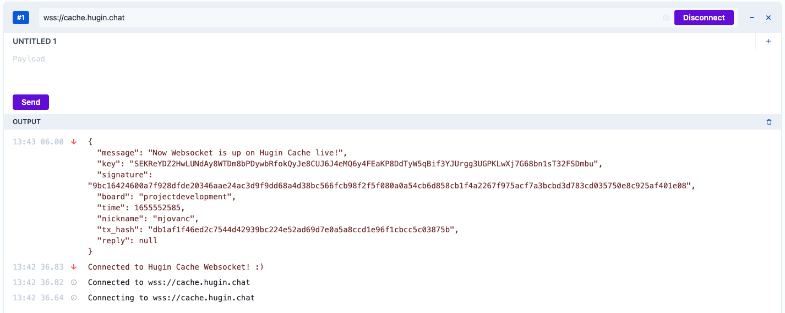
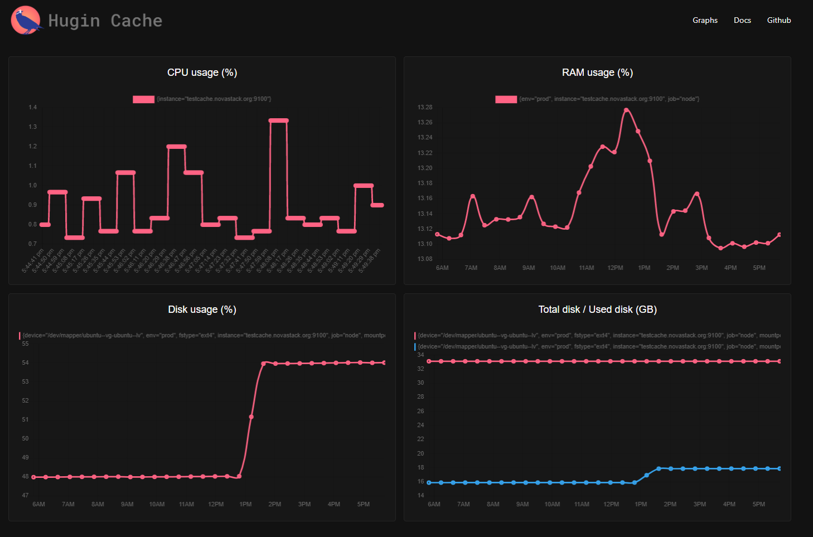
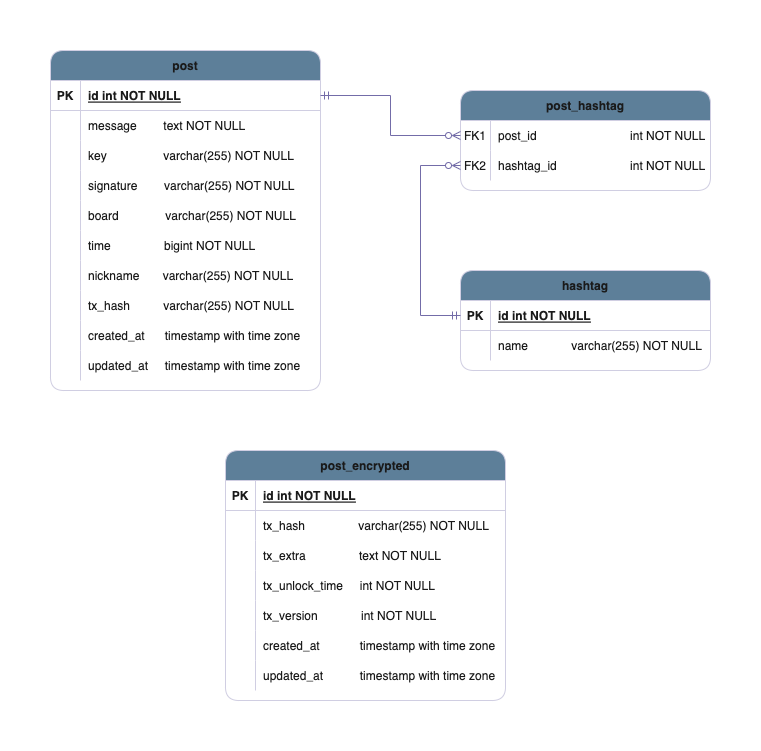

<p align="center">
  
</p>

<p>
<a href="https://chat.kryptokrona.se">
    
</a> 
<a href="https://github.com/kryptokrona/hugin-cache/actions">
    
</a>
<a href="https://github.com/kryptokrona/hugin-cache/issues">
    
</a>
<a href="https://github.com/kryptokrona/hugin-cache/pulls">
    
</a>
<a href="https://github.com/kryptokrona/hugin-cache/commits/main">
    
</a>
<a href="https://github.com/kryptokrona/hugin-cache/graphs/contributors">
    
</a>
<a href="https://github.com/kryptokrona/hugin-cache/blob/main/LICENSE">
    
</a>
<a href="https://twitter.com/kryptokrona">
    
</a>
</p>

Hugin is a messaging service where messages are stored on the Kryptokrona Blockchain. Messages are secured with industry leading encryption so that only you and your chat partner have the possibility to read them. The purpose is not to gather any personal information about the users, unlike most apps and social media.

Hugin also packs some powerful decentralized P2P encrypted features like video, voice, screen sharing and filesharing.

To be able to get data more easily from Hugin this RESTful API called Hugin Cache was created. It provides useful endpoints for within the Kryptokrona project as well as other external 3rd party interests. 

# Table of Contents

- [Table of Contents](#table-of-contents)
- [Development Resources](#development-resources)
- [Technologies](#technologies)
- [Websockets](#websockets)
- [Dashboard](#dashboard)
- [Onion Services](#onion-services)
- [API Endpoints](#api-endpoints)
  - [Examples](#examples)
    - [JavaScript](#javascript)
    - [Python](#python)
- [Database Diagram](#database-diagram)
- [Usage](#usage)
- [Test environment](#test-environment)
  - [Database dump](#database-dump)
- [Testing](#testing)
  - [Unit testing](#unit-testing)
  - [Code Coverage](#code-coverage)
- [Build, Test and Deployment](#build-test-and-deployment)
- [Contribute](#contribute)
  - [Pull request](#pull-request)
  - [Donate](#donate)
    - [Bitcoin (BTC)](#bitcoin-btc)
    - [Monero (XMR)](#monero-xmr)
    - [Kryptokrona (XKR)](#kryptokrona-xkr)
- [Help and Support](#help-and-support)
- [FAQ](#faq)
- [Sponsors](#sponsors)
- [Contributors](#contributors)
- [License](#license)

# Development Resources

- Web: kryptokrona.org
- Mail: mjovanc@protonmail.com
- GitHub: https://github.com/kryptokrona
- Hugin: projectdevelopment board on Hugin Messenger
- It is HIGHLY recommended to join our board on Hugin Messenger if you want to contribute to stay up to date on what is happening on the project.

# Technologies

- Express
- Sequelize
- c8
- k6
- Mocha
- Chai
- hugin-crypto
- ws
- Swagger
- prometheus
- Chart.JS
- Onion Service (Tor)

And a lot of other packages/libraries which can seen in **package.json**.

# Websockets

We have implemented Websockets that are listening on `wss://<domain>`. You can try it out using [Websocket King Client](https://websocketking.com/).



# Dashboard

To show the usage of the cache, we have developed a dashboard with graphs of CPU, RAM and disk usage. To access the dashboard go to your domain and end it with /dashboard, for example https://cache.hugin.chat/dashboard



# Onion Services

We use Tor to provide API data through a Onion Service. To be able to access it use the Onion address on your server (use `tail /var/lib/tor/hugin_cache/hostname` to read it) and open a Onion browser such as Tor. So for example read the posts from the API use https://<your_onion_address>/api/v1/posts

# API Endpoints

All available API endpoints can be seen here on our Postman: https://www.postman.com/kryptokrona?tab=collections

## Examples

Below are some code examples in JavaScript and Python how to use the Hugin Cache to get data. To just try out the API and check out what kind of data that we expect to get back we recommend you check out our Postman.

### JavaScript

**POSTS**

Get all posts:

```javascript
import axios from 'axios'

axios.get('http://localhost:3000/api/v1/posts')
  .then(response => {
    console.log(response)
  })
  .catch(err => {
    console.log('ERROR: Could not get all posts from Hugin Cache.')
  })
```

**HASHTAGS**

Get trending hashtags:

```javascript
import axios from 'axios'

axios.get('http://localhost:3000/api/v1/hashtags/trending')
  .then(response => {
    console.log(response)
  })
  .catch(err => {
    console.log('ERROR: Could not get all trending hashtags from Hugin Cache.')
  })
```

### Python

**POSTS**

Get all posts:

```python
import requests
from requests.exceptions import ConnectionError, Timeout, TooManyRedirects

API_URL = 'http://localhost:3000/api/v1/posts'

try:
    headers = {'Content-Type': 'application/json'}
    response = requests.get(API_URL, headers=headers)
    print(response.json())
except (ConnectionError, Timeout, TooManyRedirects):
    print('ERROR: Could not get all posts from Hugin Cache.')
```


**HASHTAGS**

Get trending hashtags:

```python
import requests
from requests.exceptions import ConnectionError, Timeout, TooManyRedirects

API_URL = 'http://localhost:3000/api/v1/hashtags/trending'

try:
    headers = {'Content-Type': 'application/json'}
    response = requests.get(API_URL, headers=headers)
    print(response.json())
except (ConnectionError, Timeout, TooManyRedirects):
    print('ERROR: Could not get all trending hashtags from Hugin Cache.')
```

# Database Diagram

This Database Diagram demonstrates how we store the data:



To edit the diagram open up the file inside the directory **diagrams** called **database-diagram.drawio**.

# Usage
**NOTE**: Node version 18 LTS is needed for this to function!
- `apt install gcc build-essential make`

- `npm install nodemon -g`

- `npm install`

- `npm run db:migrate`

- `npm run dev`

# Test environment

To just test the code, the easiest way is to use Docker Compose to orchestrate up the environment since we then don't have to install and configure the PostgreSQL database. 

Run the following to start orchestrating:

- `docker-compose up`

If we have done some changes to our code we need to run `docker-compose up --build` to force rebuilding the images.

We can also run `docker-compose up --scale postgres=0` to just run the Hugin Cache Docker container without the PostgreSQL database.

If we already have a database up and configured we can run the following to build and start the Hugin Cache docker image:

```
docker run -p 3000:3000 \
    --name hugin-cache \
    -e POSTGRESQL_HOSTNAME=postgres \
    -e POSTGRESQL_PORT=5432 \
    -e POSTGRESQL_DB_NAME=hugin_cache_dev \
    -e POSTGRESQL_DB_USER=postgres \
    -e POSTGRESQL_DB_PASSWORD=test1234 \
    -e NODE_ENV=development
```

## Database dump

To simplify the testing we also provide a database dump. Its real data captured from hugin so its great way to either get some base data in the database to test the API or to try new features!

To load in the data you run the following in the hugin cache folder:

```
psql hugin_cache < database/samples/database_dump.sql
```
NOTE: For the above to function make sure you HAVE NOT ran the npm run db:migrate commands since this will cause issues!

# Testing

## Unit testing

Unit tests are conducted using Mocha and Chai. All unit tests can be found under the **tests** directory in the root of
this repository.

To run the tests:

- `npm run test`

## Code Coverage

We are using C8 as the tool to execute the code coverage. We have a global threshold of 75%, this will probably increase a little over time when we optimize our code. But for now we will use 75%. To run all test and get code coverage results run the command:

- `npm run code-coverage`

To be able to view in detail we can generate the report in HTML, we run the following command (it will automatically open it in your default browser):

- `npm run code-coverage-report`

# Build, Test and Deployment

This project is automatically built, tested and deployed using GitHub Actions. We have two pipelines:

- **Main Pipeline** - This is the pipeline that runs the code merged into our main branch.
- **Pull Request Pipeline** - This is the pipeline that runs each time a pull request come in so the reviewer has some help evaluating the code health.

The Main Pipeline do everything the Pull Request Pipeline does in addition to building and publishing a Docker Image to
the project tagged by the project name, owner, repository and short form of commit SHA value. We also setup continuous deployment
so if all the steps succeed the server will update its currently running docker container with a new image.

To learn how we deploy to our VPS read the documentation here: [Ansible Documentation](ansible/README.md)

# Contribute

## Pull request

We appreciate all contributions whether it be small changes such as documentation of source code to major improvement of code. The easiest way is to make a fork and then make a pull request into our main branch. To make the PR go through make sure to include this information:

```
What does this PR do?

Why are these changes required?

This PR has been tested using (e.g. Unit Tests, Manual Testing):

Extra details?
```

A pull request is approved if the GitHub Actions pipeline is marked green. Otherwise it will be closed directly. Always make sure to run the unit tests before creating a pull request.

## Donate

### Bitcoin (BTC)

BTC: bc1ql97dlhhexma7agkk7gmg76t7ljycuqc9xgr4vl


### Monero (XMR)

XMR: 49AWzFTrZZvDKNzCUHPSXm5ZUyBrFan7xXXrKmfS6ircfcTAeiXBH1Yg99V4jiiEdT8RYhXvEiAgbMjEzq8AJJCbAd5ckJG


### Kryptokrona (XKR)
XKR: SEKReXXU9aJPiwjX2XkpbK8ACMWbUNXcYPxUVSiUYpNdhj8Z2snEy8CjjorZUNyswQNfzAmVWuGksU72Sf3Kq79Zd3fJWHq4Nyx


# Help and Support

For questions and support please use the channel #support in Kryptokrona Discord server. The issue tracker is for bug reports and feature discussions only.

# FAQ

- Q: How do I distribute my own Hugin Cache so I can decide what data to collect?
    - A: You can read through the tutorial here created by Marcus Cvjeticanin: [Distribute content from the Kryptokrona blockchain with Hugin Cache
](https://mjovanc.com/distribute-content-from-the-kryptokrona-blockchain-with-hugin-cache-81aa6703530)
- Q: How do I upgrade my Hugin Cache?
  - A: Read through the guide here https://medium.com/coinsbench/upgrade-your-hugin-cache-2b1e1f2bd5d8
- Q: Where do I find the log output to see if something went wrong?
  - A: The log output can be seen in output.log in the root of the container where the source code exits.

# Sponsors

The following sponsors are either helping the project with free usage, great discounts of services or in other ways helping
via advertisement.

<p align="left">
  
</p>

# Contributors

The following contributors have either helped to start this project, have contributed
code, are actively maintaining it (including documentation), or in other ways
being awesome contributors to this project. **We'd like to take a moment to recognize them.**

[](https://github.com/mjovanc)
[](https://github.com/TechyGuy17)
[](https://github.com/Coffeboi)
[](https://github.com/Swepool)

# License

The license is GPL-3.0 License.
