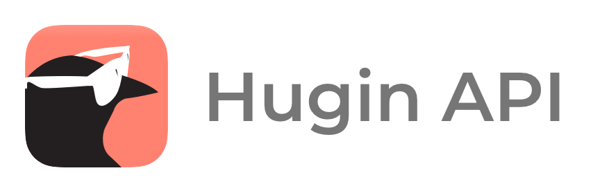

# 

 

Hugin is a messaging service where messages are stored on the Kryptokrona Blockchain. Messages are secured with industry leading encryption so that only you and your chat partner have the possibility to read them. The purpose is not to gather any personal information about the users, unlike most apps and social media.

Hugin also packs some powerful decentralized P2P encrypted features like video, voice, screen sharing and filesharing.

To be able to get data more easily from Hugin this RESTful API and websocket server called Hugin API was created. It provides useful endpoints for within the Kryptokrona project as well as other external 3rd party interests that wants to host their own Hugin API.

# Table of Contents

- [!Hugin API](#)
- [Table of Contents](#table-of-contents)
- [Development Resources](#development-resources)
- [Sponsors](#sponsors)
- [Usages](#usages)
- [Contributors](#contributors)
- [License](#license)

# Development Resources

- Web: https://kryptokrona.org
- Docs: https://docs.kryptokrona.org
- Mail: mjovanc@icloud.com
- GitHub: https://github.com/kryptokrona
- Hugin: projectdevelopment board on Hugin Messenger
- It is HIGHLY recommended to join our board on Hugin Messenger if you want to contribute to stay up to date on what is happening on the project.

# Sponsors

The following sponsors are either helping the project with free usage, great discounts of services or in other ways helping
via advertisement.

  

# Usages

Our API is useful! Projects using Hugin API:

- [Official Kryptokrona Website](https://www.kryptokrona.org/)
- [Kryptokrona Block Explorer](https://github.com/kryptokrona/kryptokrona-block-explorer)
- [Hugin Mobile](https://github.com/kryptokrona/hugin-mobile)
- [Hugin Bridge](https://github.com/kryptokrona/hugin-bridge)
- [Hugin Node.JS Client](https://github.com/TechyGuy17/Hugin-client-nodejs)
- [Hugin Desktop](https://github.com/kryptokrona/hugin-desktop)

If you are using Hugin API, please fork and make a pull request into our repo with your added link. 

# Contributors

The following contributors have either helped to start this project, have contributed
code, are actively maintaining it (including documentation), or in other ways
being awesome contributors to this project. **We'd like to take a moment to recognize them.**

# License

The license is BSD-3 License.
